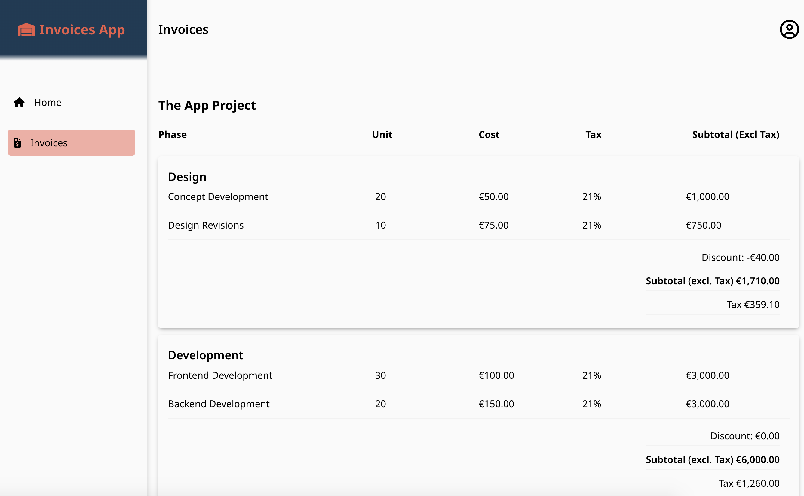

# InvoicePage API Frontend

A React application that renders an invoice UI application to handle viewing invoices. The frontend allows the user to view an invoice for a project.

Built with Vitejs, React, react-router, apollo. Styling is done with scss.

## Demo

[Live Preview](https://the-invoice-app.netlify.app)

## Run locally

- Clone the Repository
- `npm ci`
- `npm run dev`
- App should open in `http://localhost:3000`

To run the tests, `npm run test`

### Decisions

#### Vite

This is now the recommended approach for react single page applications. It provides very fast server start and HMR. It also features a lot of plugins and fully typed APIs.

#### React router

This is a small app, however, adding the react-router to application is beneficial for url and browser history.

#### Apollo

The app API layer will be built using GraphQL. Currently, the api is mocked locally, so it's not connected to the backend. I used Apollo library for its great developer experience, and caching.

## Screenshots

